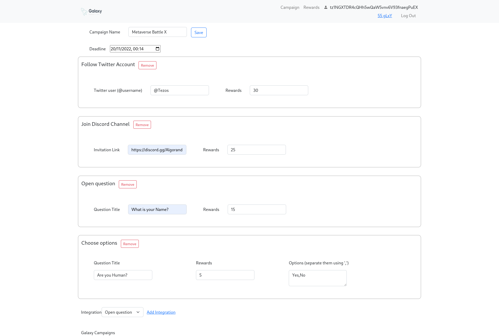
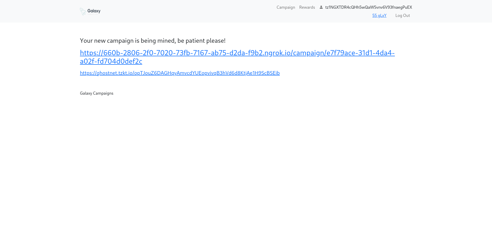
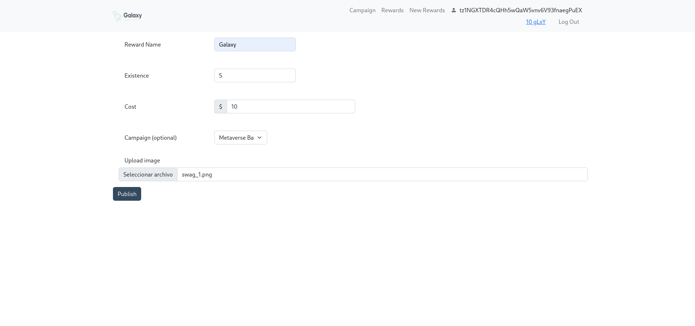
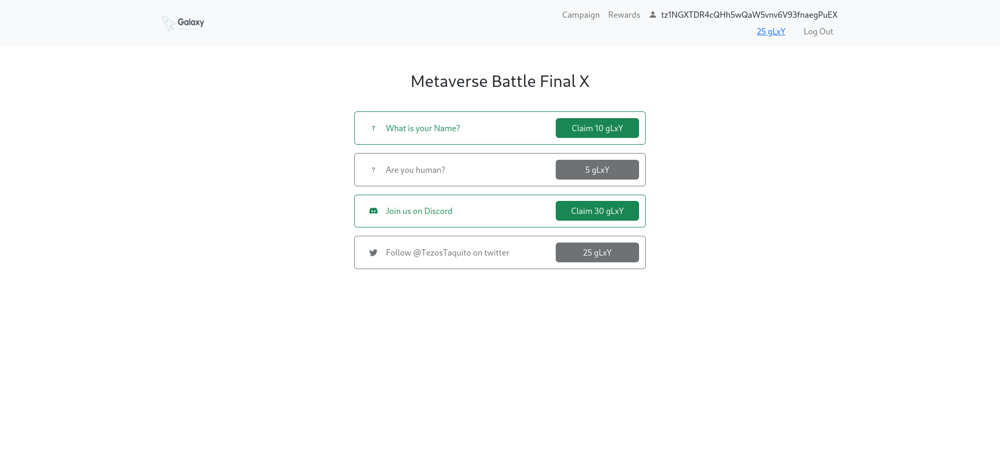
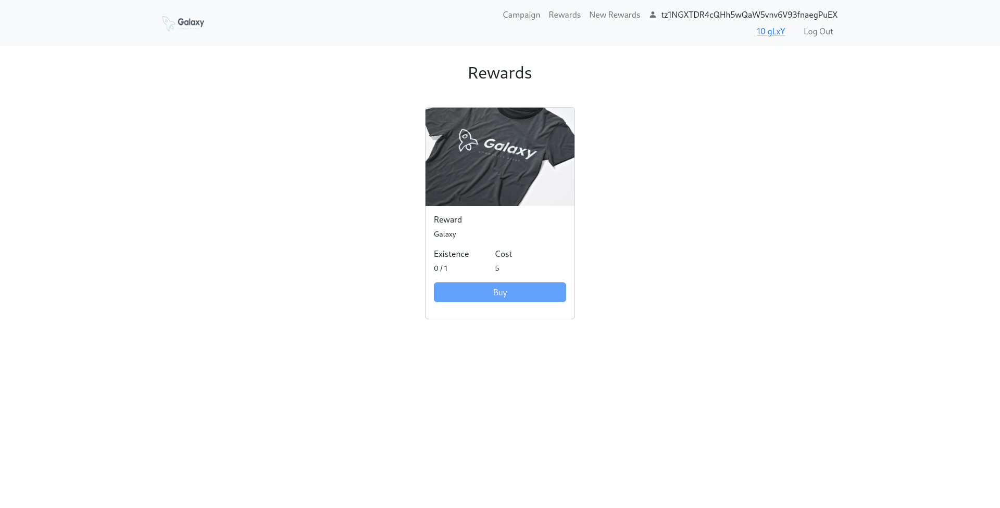

# Galaxy - Campaigns & Rewards

Galaxy is a loyalty platform where you can create campaign and reward your users with some 
prizes or t-shirts.

dApp: [https://galaxy.gordian.dev/](https://galaxy.gordian.dev/) 

Demo: 
https://www.loom.com/share/82370b69d46144b3809f162ba7edd1fe

## Setup

Clone the repository and enter the Galaxy Dapp directory.

```
git clone https://github.com/zoek1/galaxy.git
tmux
cd galaxy/dapp
docker-compose build
sudo apt install redis certbot
source scripts/deploy_contract.sh
python -m venv .env
source .env/bin/activate
pip install -r server/requirements.txt
cp proxy/galaxy.conf /etc/nginx/sites-enabled
certbot -nginx
```

## Run

```
Screen 1
docker-compose up
```


```
Screen 2
cd server
flask run -p 8000
```

On your browser open [http://galaxy.dev](http://galaxy.dev)


## Where IPFS is used?
Main storage endpoint
- https://github.com/zoek1/galaxy/blob/master/server/app.py#L358

The server only store pointer to ipfs saved files:
- https://github.com/zoek1/galaxy/blob/master/server/models.py#L54
- https://github.com/zoek1/galaxy/blob/master/server/models.py#L68

Main function to retrieve IPFS files using web3.storage
- https://github.com/zoek1/galaxy/blob/master/dapp/src/utils/ipfs.js#L8


Create Campaign - All metadata is stored in web3.storage using [this function](https://github.com/zoek1/galaxy/blob/master/dapp/src/pages/NewCampaignPage.js#L177).



Create rewards for your users - Metadata and images are stored in web3.storage using [this function](https://github.com/zoek1/galaxy/blob/master/dapp/src/pages/RewardsNewPage.js#L77)  function and [this](https://github.com/zoek1/galaxy/blob/master/dapp/src/pages/RewardsNewPage.js#L62)


Let the user take actions - Metadata is retrieved from web3.storage using [this function](https://github.com/zoek1/galaxy/blob/master/dapp/src/pages/ViewCampaignPage.js#L76).


Earn rewards - Image and reward data are retrieved from web3.storage  using [this function](https://github.com/zoek1/galaxy/blob/master/dapp/src/pages/RewardsPage.js#L21).



## License

See [LICENSE](LICENSE).
